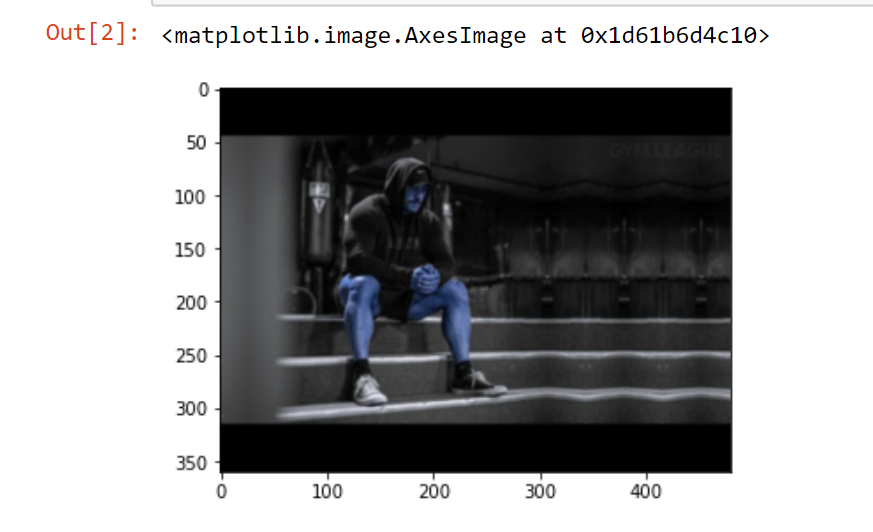
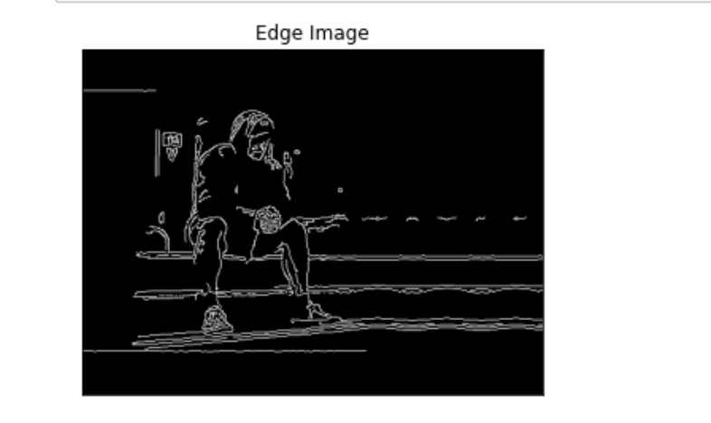
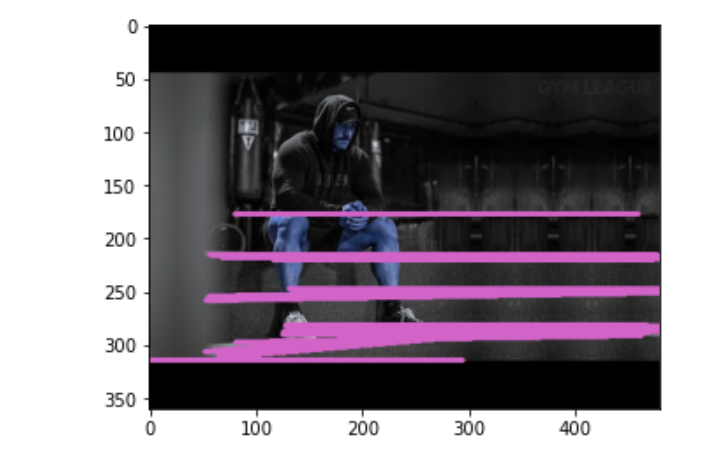

# Edge-Linking-using-Hough-Transform
## Aim:
To write a Python program to detect the lines using Hough Transform.

## Software Required:
Anaconda - Python 3.7

## Algorithm:
### Step1:
<br>Import all the necessary modules for the program.

### Step2:
<br>Load a image using imread() from cv2 module.

### Step3:
<br>Convert the image to grayscale.

### Step4:
<br>Using Canny operator from cv2,detect the edges of the image

### Step5:
<br>Using the HoughLinesP(),detect line co-ordinates for every points in the images.Using For loop,draw the lines on the found co-ordinates.

### Step6:
<br>Display the image and end the program.

## Program:
```
developed by: Kirupanandhan.T
register no.:21221230051

# Read image and convert it to grayscale image
import cv2
import numpy as np
import matplotlib.pyplot as plt
BGR_image=cv2.imread('image.jpg')
gray=cv2.cvtColor(BGR_image,cv2.COLOR_BGR2GRAY)
img= cv2.GaussianBlur(BGR_image,(3,3),0)
plt.imshow(img)

# Find the edges in the image using canny detector and display
edges1 = cv2.Canny(img,100,200)
plt.imshow(edges1,cmap = 'gray')
plt.title('Edge Image'), plt.xticks([]), plt.yticks([])
plt.show()


# Detect points that form a line using HoughLinesP

lines=cv2.HoughLinesP(edges1,1,np.pi/180, threshold=80, minLineLength=50,maxLineGap=250)


# Draw lines on the image
for line in lines:
    x1, y1, x2, y2 = line [0] 
    cv2.line(BGR_image,(x1, y1),(x2, y2),(210,100,200),3)
  


# Display the result
  plt.imshow(BGR_image)


```
## Output

### Input image and grayscale image

<br>
<br>
<br>

### Canny Edge detector output

<br>
<br>
<br>


### Display the result of Hough transform

<br>
<br>
<br>


## Result:
Thus the program is written with python and OpenCV to detect lines using Hough transform. 
